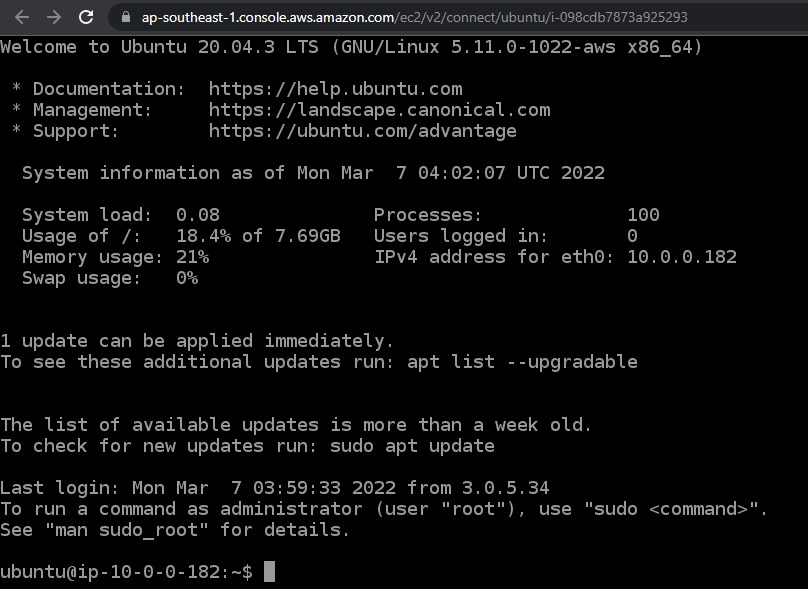
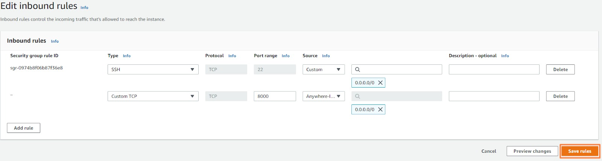

# LAYANAN-LAYANAN PADA AWS
## Jaringan Virtual dengan Amazon VPC (AMAZON VIRTUAL PRIVATE CLOUD)
Langkah-langkah membuat VPC:
- Pertama, silakan buka AWS Management Console, klik ```Sign``` In di kanan atas, lalu isi ```email address``` dan ```password``` sesuai yang Anda daftarkan. Apabila selepas masuk ke halaman utama AWS Management Console tampil popup New AWS Console Home, silakan pilih ```Switch to the new Console Home.```
- Kemudian, kita perlu memilih Region terlebih dahulu untuk menentukan lokasi di mana VPC yang akan kita buat berada. <br>
<br>

- Selanjutnya, masuk ke halaman VPC (Virtual Private Cloud) dengan cara ketikkan ```vpc``` di kotak pencarian di samping menu Services. <br>
<br>

- Pastikan Anda sedang berada di Region Singapore (lihat kanan atas). Lalu, masuklah ke menu Your ```VPCs``` pada navigasi sebelah kiri, kemudian klik tombol ```Create VPC``` <br>
<br>

Catatan: Bisa Anda tengok di sana sudah terdapat sebuah VPC, ia adalah default VPC yang penulis maksud di awal.

- Isikan sesuai konfigurasi berikut. 
  - Recourse to create = VPC only
  - Name tag = VPC-A
  - IPv4 CIDR block = IPv4 CIDR manual input
  - IPv6 CIDR block = No IPv6 CIDR block
  - Tenancy = Default <br>
Jika sudah, lanjutkan dengan klik tombol Create VPC. <br>
- Oke, kita telah membuat VPC-A. Selanjutnya, mari kita buat Internet gateway yang kemudian akan dipasang ke VPC-A. Masih berada di halaman VPC, silakan masuk ke menu ```Internet Gateways -> Create internet gateway```. <br>
<br>

- Isikan nama Internet gateway Anda dengan ```VPC-A-IGW```, lalu klik tombol ```Create internet gateway```. <br>
<br>

- Setelah Internet gateway terbuat, akan muncul tombol ```Attach to a VPC``` di atas halaman. Klik tombol tersebut. Pada bagian Available VPCs, pilihlah ```VPC-A```, lalu klik tombol ```Attach internet gateway```.

## Membuat Subnet
Langkah berikutnya adalah membuat Subnet A (public subnet) dan Subnet B (private subnet) untuk VPC-A:
- Masih di halaman ```VPC```, klik menu ```Subnets -> Create subnet```. <br>
<br>

- Di bagian ```VPC ID```, klik dropdown arrow dan pilihlah ```VPC-A```. Kemudian, pada bagian ```Subnet settings```, silakan isi field yang diperlukan sesuai konfigurasi berikut.
  - Subnet name = Subnet-A
  - Availability Zone = ap-southeast-1a
  - IPv4 CIDR Block = 10.0.0.0/24
- Lanjut, klik tombol ```Add new subnet``` untuk membuat subnet kedua. Ikuti konfigurasi berikut.
  - Subnet name = Subnet-B
  - Availability Zone = ap-southeast-1b
  - IPv4 CIDR Block = 10.0.1.0/24
- Jika semua konfigurasi sudah benar, silakan klik tombol ```Create subnet```.

## Konfigurasi Route Table
- Masuklah ke menu ```Route Tables -> Create route table```. <br>
<br>

- Pada halaman ini, silakan isikan dengan konfigurasi berikut.
  - Name = Route-Table-A
  - VPC = VPC-A
  - Klik ```Create route table```.
- Di halaman detail Route-Table-A, pilih menu ```Actions -> Edit subnet associations```. <br>
<br>

- Anda akan memasuki halaman ```Edit subnet associations```. Di sini, centang ```Subnet-A``` dan klik ```Save associations```. <br>
<br>

- Kembali ke menu Route Tables -> Create route table. Isikan dengan konfigurasi berikut.
  - Name = Route-Table-B
  - VPC = VPC-A
  - Klik ```Create route table```.
- Di halaman detail ```Route-Table-B```, pilih menu ```Actions -> Edit subnet associations```.
- Selepas itu, Anda akan memasuki halaman ```Edit subnet associations```. Di sini, centang ```Subnet-B``` dan klik ```Save associations```.
- Perlu Anda ketahui bahwa kedua route table yang telah Anda buat tadi hanya memiliki perutean lokal ke VPC-A, yaitu 10.0.0.0/16. Anda bisa temukan dengan klik menu ```Route Tables``` -> centang ```Route-Table-A``` -> klik tab ```Routes```. <br>
<br>

- Sementara itu, kita juga membutuhkan route yang menuju ke Internet gateway di Subnet-A agar ia menjadi public subnet dan dapat berkomunikasi dengan internet. Jadi, mari tambahkan route baru dengan klik tombol ```Edit routes```. <br>
<br>

- Untuk menambahkan route, klik tombol ```Add route```, lalu isi sesuai konfigurasi berikut. 
  - Destination = 0.0.0.0/0
  - Target = Internet Gateway -> VPC-A-IGW
  - Jika sudah, silakan klik tombol ```Save changes```.
- Setelah itu, gulir halaman ke bawah hingga Anda menemukan bagian Routes. Perhatikan kini Anda memiliki route seperti berikut. <br>
<br>

- Perjalanan kita usai sampai di sini. Kita tak perlu menambah route ke Internet gateway untuk Subnet-B. Musabab sesuai diagram Subnet-B adalah private subnet. <br>
Hore! Kita sudah berhasil membangun VPC-A beserta segala komponennya. Yuk lihat kembali gambar arsitektur kita. <br>
<br>

## Meluncurkan Amazon EC2 Instance
- Untuk membuat EC2 instance, silakan masuk ke AWS Management Console, klik ```Sign In``` di kanan atas, dan login menggunakan kredensial Anda.
- Selanjutnya, ketikkan ec2 di kotak pencarian, kemudian pilih menu ```EC2```. <br>
<br>

- Setelah itu, Anda diarahkan ke halaman EC2 Dashboard. Di halaman tersebut, cari dan klik tombol oranye bertuliskan ```Launch instance``` dan klik lagi ```Launch Instance``` untuk membuat EC2 instance. <br>
<br>

- Pastikan Anda mengaktifkan toggle New EC2 Experience di pojok kiri atas. <br>
<br>

- Sesudahnya, Anda akan masuk ke halaman pembuatan EC2 instance. Pertama-tama, isikan nama instance (misal, ```Web Server```) pada kolom Name. Ini berfungsi untuk menandai atau dalam kata lain sebagai identitas dari EC2 instance yang kita buat.

- Selanjutnya adalah pemilihan Amazon Machine Image (AMI). AMI merupakan sebuah template yang berisi konfigurasi software seperti sistem operasi, server aplikasi, dan beberapa tools lainnya. Untuk menjalankan EC2 instance, kita perlu memilih AMI yang sesuai. Pada latihan ini, silakan klik ```Ubuntu``` dan pastikan yang terpilih adalah ```Ubuntu Server 20.04 LTS``` untuk instance kita. <br>
<br>

- Kemudian, pada bagian Instance type (konfigurasi mesin instance), biarkan pada opsi pilihan ```t2.micro```. Ini menjadi pilihan yang tepat karena kita dapat menggunakannya secara gratis.
- Untuk bagian Key pair, kita pilih opsi ```Proceed without a key pair```. Musabab, saat ini kita masih belum membutuhkannya.
- Setelah itu, Anda perlu mengatur beberapa pengaturan jaringan (Network settings) agar selaras dengan latihan sebelumnya. Kita ingin EC2 instance ini berada di VPC yang telah dibuat sebelumnya, yakni VPC-A. Maka dari itu, klik tombol ```Edit```, lalu sesuaikan dengan konfigurasi berikut.
  - VPC = VPC-A
  - Subnet = Subnet-A (ingat bahwa ini public subnet)
  - Auto-assign Public IP = Enable (agar instance mendapat public IP sehingga bisa diakses oleh publik) <br>
<br>

- Masih pada bagian Network settings, selanjutnya adalah konfigurasi security group. Seperti yang telah dijelaskan sebelumnya, security group bertindak sebagai firewall virtual untuk mengontrol lalu lintas yang masuk dan keluar dari EC2 instance Anda. Secara default, saat kita membuat security group, AWS telah menambahkan aturan untuk mengizinkan akses SSH dari semua IP address. Akses SSH ini digunakan untuk mengoperasikan EC2 instance dari jarak jauh (dari komputer pribadi). Silakan sesuaikan dengan konfigurasi berikut.
  - Firewall (Security groups) = Create security group
  - Security group name = web-server-sg
  - Description = Allow SSH <br>
<br>

- Usai itu, Anda akan dihidangkan dengan konfigurasi storage (penyimpanan). Sejujurnya, saat ini kita belum membutuhkan storage yang terlalu besar. Kita bisa membuat web server pada volume root berkisar 8 GB. Oleh karena itu, biarkan konfigurasi sesuai default dan lanjut klik tombol ```Launch instance``` di sebelah kanan.
- EC2 instance berhasil dibuat dan berjalan. Anda bisa melihat statusnya dengan mengeklik tombol ```View all instances```. Anda bisa lihat status dari instance tersebut adalah Running. <br>
<br>

- Di tab EC2 Instance Connect, klik tombol oranye bertuliskan ```Connect``` untuk terhubung ke EC2 instance Anda. <br>
<br>

- Sebuah browser tab baru pun akan terbuka dan menampilkan konsol dari EC2 instance Anda. <br>
<br>

- Oke, mulai sekarang kita akan sering berinteraksi dengan konsol ini. Dengannya, kita akan melakukan banyak hal. Pertama, mari kita clone (salin/unduh) repositori GitHub yang diperlukan terlebih dahulu. Jalankan perintah berikut ini ```git clone https://github.com/dicodingacademy/a387-jarkom-labs.git```.
- Lalu, masuk ke folder latihan dengan perintah berikut ```cd a387-jarkom-labs/```
- Langkah selanjutnya adalah menjalankan web server. Namun, karena untuk menjalankan web server membutuhkan Node.js, kita perlu memasang Node.js pada EC2 instance terlebih dahulu.
- Agar mudah mengatur versi Node.js pada EC2 instance, gunakanlah tools bernama nvm. Melalui nvm ini, kita bisa dengan mudah memilih versi Node.js yang ingin digunakan. Tools ini sangat membantu proses upgrade atau downgrade Node.js secara mudah. Untuk memasang nvm pada Ubuntu, silakan eksekusi perintah berikut ```curl -o- https://raw.githubusercontent.com/nvm-sh/nvm/v0.37.2/install.sh | bash```.
- Tunggu hingga proses unduh dan instalasi selesai. Penting! Agar nvm dapat digunakan, silakan keluar dulu dari EC2 Instance Connect dengan perintah berikut ```exit```.
- Lalu, akses kembali instance Anda melalui fitur EC2 Instance Connect. <br>
<br>

- Selanjutnya pasang Node.js versi v14.15.4 dengan perintah berikut ```nvm install v14.15.4```
- Untuk mengecek version Node.js yang telah terpasang bisa menggunakan perintah ```node -v```
- Well done! Node.js berhasil terpasang. Kini Anda bisa menjalankan web server. Pastikan Anda berada di dalam folder ```a387-jarkom-labs```. Jika belum, silakan masuk ke foldernya dengan perintah berikut: ```cd a387-jarkom-labs/```.
- Instal beberapa dependencies yang dibutuhkan oleh web server Node.js dengan menjalankan perintah ini: ```npm install```
- Lanjut, jalankan web server dengan perintah berikut: ```npm run start```

## Menguji Web Server
- Silakan buka browser tab baru dan buka ```http://192.168.1.1:8000/```. Anda bisa temukan public IP address di bagian bawah EC2 Instance Connect. Catatan: Angka 8000 adalah port number yang digunakan oleh web server kita.<br>
<br>
- Sayangnya, Anda akan mendapati halaman browser yang terus loading. Lo, kenapa ya? <br>
<br>
- Masalah ini terjadi karena kita belum mengizinkan firewall untuk akses HTTP. Maka dari itu, tahapan selanjutnya adalah mengonfigurasi firewall pada Amazon EC2.

## Firewall di AWS
Pada modul Keamanan Jaringan, kita sudah membahas tuntas tentang firewall. Dalam modul tersebut tertera bahwa firewall adalah sebuah sistem yang bertindak sebagai penjaga keamanan dan berada di antara internet dan jaringan internal (lokal/pribadi/perusahaan) Anda. <br>

Lantas, bagaimana implementasinya di AWS? Tenang saja, AWS memiliki layanan firewall yang begitu menarik nan powerful. Di AWS, ada dua layanan penting terkait firewall yang wajib kita pelajari, mereka adalah Network ACL dan Security Group. Keduanya merupakan firewall, tetapi memiliki cakupan dan fitur yang berbeda. Nanti akan kita kupas satu per satu. <br>

Tentunya Anda masih ingat tentang Internet Gateway, bukan? Kita sudah pelajari itu secara teori dan juga praktik. Internet Gateway adalah layanan yang bertindak seperti “gerbang” yang bisa Anda lampirkan untuk mengizinkan akses keluar masuk internet di VPC Anda. Layaknya “gerbang” tanpa penjaga, ia hanya bisa membiarkan lalu lintas masuk dan keluar begitu saja tanpa pemfilteran. <br>

Jadi, kita membutuhkan firewall untuk menjaga lalu lintas di VPC. Oleh karena itu, terciptalah Network ACL dan Security Group yang siap membantu menjaga sumber daya AWS di VPC Anda. <br>

Penasaran? Mari kita bedah sekarang juga! <br>

## Network ACL
Sama seperti firewall secara umum yang merupakan bagian dari penguatan jaringan (network hardening), Network ACL (access control list) termasuk salah satu layanan penguatan jaringan yang ada di AWS. Network ACL bertindak sebagai firewall virtual untuk mengontrol lalu lintas masuk dan keluar dari subnet di AWS. <br>

Tidak seperti Internet Gateway yang bersemayam di cakupan VPC, Network ACL ini bertugas untuk menjaga wilayah ```Subnet```. <br>
<br>

Ketika seorang client atau pelanggan melakukan request (permintaan), maka permintaan tersebut akan dikirim dalam bentuk packet jaringan. Jika Anda lupa, packet adalah sebuah unit data yang dikirim melalui internet atau jaringan. <br>

Mekanismenya, packet akan masuk ke VPC melalui Internet Gateway. Nah, sebelum packet masuk atau keluar dari subnet, packet akan diperiksa terkait perizinan. Pemeriksaan ini dilakukan untuk melihat apakah packet memiliki izin (permission) untuk masuk ke subnet atau tidak berdasarkan siapa pengirimnya (IP address) dan bagaimana ia mencoba berkomunikasi dengan sumber daya (misal EC2 instance) yang berada di subnet (protokol dan nomor port). Nah, komponen VPC yang memeriksa izin packet untuk subnet adalah Network ACL (access control list). <br>
<br>

Jika ternyata packet jaringan yang masuk mempunyai potensi yang dapat membahayakan sumber daya (misal EC2 instance) di dalam subnet, packet tersebut akan diblokir sebelum dapat masuk ke subnet di VPC. <br>

Apakah Anda masih kesulitan memahami Network ACL? Oke, mari kita buat analogi. Anda bisa menganggap Network ACL ini sebagai petugas pengawas paspor. Imajinasikan Anda sedang berada di bandara. Di sana pastinya ada banyak turis yang mencoba masuk ke negara kita. Nah, Anda dapat menganggap para turis itu sebagai packet jaringan dan petugas pengawas paspor sebagai Network ACL. <br>

Petugas pengawas paspor akan memeriksa kredensial setiap turis yang masuk ke negara kita. Jika nama turis tertera di dalam daftar yang disetujui, ia diizinkan masuk. Sebaliknya, jika namanya tak terdaftar atau bahkan secara eksplisit tercatat di dalam daftar turis yang diblokir, tentu ia dilarang masuk. <br>

Selain memeriksa lalu lintas yang masuk, Network ACL pun akan mengecek setiap traffic yang keluar dari subnet. Ini serupa dengan petugas pengawas paspor. Hanya karena seorang turis diizinkan masuk, bukan berarti petugas akan membiarkannya keluar dengan leluasa. Turis tersebut juga akan diperiksa lagi sebelum ia pulang ke negara asalnya. <br>

Perlu Anda ketahui juga bahwa setiap akun AWS sudah disertai Network ACL bawaan (default). Saat mengonfigurasi VPC, Anda dapat menggunakan default Network ACL (yang mengizinkan semua lalu lintas masuk dan keluar) atau custom Network ACL (yang pada awalnya akan menolak semua lalu lintas masuk dan keluar sampai Anda mengizinkannya atau allow secara eksplisit). <br>

Selain itu, Network ACL juga memiliki aturan penolakan secara eksplisit. Aturan ini berguna untuk memastikan apabila sebuah packet tidak cocok dengan salah satu aturan di daftar yang diizinkan, packet tersebut akan ditolak sehingga tak boleh masuk subnet. <br>

Mungkin Network ACL ini terdengar seperti keamanan yang hebat, tetapi sayangnya Network ACL tak bisa berdiri sendiri dan menjawab semua masalah terkait kontrol akses jaringan. Musababnya, Network ACL hanya dapat memeriksa packet jika melintasi batas subnet saja (baik masuk atau keluar), tetapi ia tak tahu-menahu apakah packet tersebut dapat mencapai EC2 instance atau tidak. <br>

Untuk itulah hadir Security Group yang membantu memecahkan masalah ini.

## Security Group
Apabila Network ACL bertugas di wilayah subnet, Security Group ini bertanggung jawab untuk menjaga EC2 instance. Jadi, setelah packet jaringan berhasil lolos dari pemeriksaan yang dilakukan oleh Network ACL, selanjutnya ia akan diperiksa oleh Security Group sebelum akhirnya bisa masuk ke suatu instance. <br>
<br>

Security Group adalah firewall virtual yang mengontrol lalu lintas masuk dan keluar untuk Amazon EC2 instance. Persis seperti yang kita lakukan pada Latihan Membuat Web Server dengan Amazon EC2. Saat kita membuat Security Group dan hanya mengizinkan akses SSH, instance tersebut dapat diakses melalui SSH, tetapi tidak bisa diakses melalui protokol lain, semisal HTTP. <br>

Ketika proses pembuatan EC2 instance, Anda akan berhadapan dengan tahapan konfigurasi Security Group. Tentu bagian ini sudah Anda temui di latihan sebelumnya. Anda bisa membuat security group baru atau memilih yang sudah ada. <br>

Perlu Anda ketahui bahwa satu Security Group bisa dikaitkan/diasosiasikan dengan beberapa Amazon EC2 instance sekaligus selama masih dalam subnet yang sama. Kendati begitu, Anda tetap bisa membuat Security Group untuk setiap instance yang berbeda. <br>

Saat Anda membuat custom Security Group, ia pada awalnya memiliki aturan yang menolak semua lalu lintas masuk dan mengizinkan semua lalu lintas yang keluar dari instance. Jika itu tak sesuai dengan kebutuhan, Anda bisa langsung mengubahnya. <br>

Misalnya, dalam kasus web server, kita bisa mengatur Security Group untuk menerima lalu lintas berbasis web (HTTP) dan menolak jenis lalu lintas selain itu. <br>

Bagaimana? Masih ada kebingungan? Mari coba dengan sebuah analogi. Jika sebelumnya kita mengibaratkan Network ACL sebagai petugas pengawas paspor, sekarang anggaplah Security Group itu seperti penjaga pintu di gedung apartemen Anda. Dalam hal ini, gedung apartemen tersebut adalah EC2 instance. <br>

Penjaga pintu akan memeriksa setiap orang yang ingin memasuki gedung untuk memastikan apakah mereka memiliki izin atau tidak. Namun, bagi setiap orang yang akan keluar dari gedung tersebut, mereka tak akan diperiksa olehnya. <br>

Serupa dengan itu, apabila sebuah packet jaringan diizinkan masuk oleh Security Group, packet tersebut akan diperbolehkan keluar. <br>

Semoga dengan materi ini, Anda semakin memahami sistem firewall di AWS bekerja. Tenang saja, kita akan mempraktikkanya di latihan yang akan datang supaya materi yang telah dipelajari kian melekat di benak Anda. <br>

## Konfigurasi Firewall dengan Security Group
Masalah ini terjadi karena kita belum mengizinkan firewall untuk akses HTTP. Jadi, dalam latihan kali ini kita akan mengonfigurasi firewall pada Amazon EC2. Namun, kita hanya mengurus Security Group dan tidak mengotak-atik Network ACL. Tunggu, kenapa Network ACL tidak dikonfigurasi, padahal kan keduanya sama-sama firewall? <br>

Ya, memang betul keduanya merupakan firewall. Akan tetapi, Network ACL secara bawaan sudah mengizinkan baik lalu lintas masuk maupun keluar. Jadi, kita tak perlu memusingkannya. Yang perlu kita sesuaikan adalah Security Group karena pada dasarnya ia menolak semua lalu lintas masuk. <br>

Saat pembuatan EC2 instance, kita hanya mengizinkan akses SSH saja, padahal kita juga membutuhkan akses HTTP agar web server bisa diakses oleh publik. Jadi, Anda sudah tahu kan apa yang akan dilakukan di latihan ini? Ya, membuka akses untuk lalu lintas HTTP. Berikut tahapan prosesnya.
- Masuk ke halaman instance detail.
- Klik nama Security Group yang dituju,
- Ubah aturan pada Security Group tersebut.
- Uji coba web server.

Mari langsung ikuti langkah-langkah berikut ini.
- Masuk ke AWS Management Console, ketikkan ec2 di kotak pencarian, kemudian pilih menu EC2. <br>
<br>

- Setelah itu, Anda akan diarahkan ke halaman EC2 Dashboard. Masuk ke menu Instances yang ada di sebelah kiri, centang instance Web Server, buka tab Security di bagian bawah, dan klik nama Security Group web-server-sg. <br>
<br>

- Lantas, Anda akan masuk ke halaman Security Group detail. Pastikan Anda berada di tab Inbound rules dan klik Edit inbound rules. <br>
<br>

- Tambahkan aturan (rule) dengan klik tombol Add rule. Setelah itu, pilih Custom TCP untuk kolom Type, 8000 (sesuai yang digunakan oleh web server) untuk isian Port range, dan Anywhere-IPv4 untuk bagian Source. Jika sudah, jangan lupa klik tombol Save rules. <br>
<br>

- Oke, Security Group sudah berhasil dikonfigurasi. Saatnya kita uji coba. Silakan masuk ke menu Instances, centang instance Web Server, lalu klik Connect. <br>
<br>

- Lanjut, pada tab EC2 Instance Connect, klik tombol Connect di bagian bawah. <br>
<br>

- Dengan begitu, konsol dari instance Anda akan terbuka. Ketikkan perintah berikut untuk pindah ke direktori web server sekaligus menjalankannya. ```cd a387-jarkom-labs/``` dan ```npm run start```

- Coba kita cek melalui browser. Silakan buka browser tab baru dan buka http://192.168.1.1:8000. Anda bisa menemukan public IP address di bagian bawah EC2 Instance Connect. <br>
<br>

- Ta-da! Web server sudah sukses berjalan yang ditandai dengan munculnya teks “Hello world!” di layar. <br>
<br>

- Mantap! Anda sudah berhasil menyelesaikan masalah firewall pada web server sehingga kini mampu berjalan dengan semestinya. Apakah perjalanan kita selesai sampai di sini? Oh, tentu tidak! Masih banyak hal-hal menarik lainnya yang perlu kita ulik. Yuk, kita sibak materi selanjutnya.

## Memasang NGINX pada EC2 Instance
Langkah pertama yang diperlukan adalah memasang NGINX pada EC2 instance. Silakan masuk ke EC2 Instance melalui SSH menggunakan metode EC2 Instance Connect seperti biasa. <br>
- Di konsol EC2 instance, instal NGINX menggunakan perintah berikut ```sudo apt update``` dan ```sudo apt install nginx -y```
- Setelah proses instalasi selesai, pastikan layanan NGINX sudah berjalan pada EC2 instance dengan menjalankan perintah ini ```sudo systemctl status nginx``` Pastikan status dari NGINX dalam keadaan active (running).
- Ketahuilah bahwa NGINX server berjalan pada port 80, yakni port default untuk protokol HTTP. Akan tetapi, port tersebut belum bisa diakses secara publik karena kita belum membuka jalan masuk (inbound) pada Security Group yang digunakan EC2 instance. Jadi, yuk tambahkan inbound rules sekarang juga.
- Silakan buka AWS Management Console, masuk ke EC2 Dashboard, lalu klik Security Groups dari menu sebelah kiri.
- Setelah itu, centang Security Group yang digunakan oleh instance Anda, yakni web-server-sg. Fokus ke bagian bawah halaman, buka tab Inbound rules, lalu klik Edit inbound rules. <br>
<br>

- Lanjut, tambahkan inbound rule baru dengan klik tombol Add rule. Kemudian, isi nilai inbound rule sesuai konfigurasi berikut.
  - Type = HTTP
  - Source = Anywhere-IPv4
- Lalu, tambahkan juga inbound rule untuk HTTPS karena kita akan menggunakannya dalam latihan yang akan datang. Anda bisa ikuti konfigurasi berikut ini.
  - Type = HTTPS
  - Source = Anywhere-IPv4
- Seperti inilah hasil akhir dari konfigurasi Inbound rules untuk Security Group web-server-sg. Bila sudah, silakan klik tombol Save rules.<br>
<br>

- Sekarang, silakan akses public IP address EC2 instance melalui browser. Anda bisa menemukannya di menu Instances -> centang Web Server instance -> salin Public IPv4 address, lalu paste di browser tab baru. Pastikan Anda tidak mengaksesnya melalui tombol open address karena itu akan membuka IP address menggunakan protokol HTTPS, sementara kita saat ini belum mengonfigurasi HTTPS sama sekali. <br>
<br>

- Semestinya NGINX sudah bisa merespons permintaan yang masuk, ditandai dengan munculnya halaman yang bertuliskan “Welcome to nginx!”. <br>
<br>

## Mengonfigurasi NGINX sebagai Reverse Proxy Server
Saat ini NGINX server sudah berjalan dengan baik. Namun, ketika diakses melalui browser, ia hanya menampilkan welcome screen sebagai petunjuk bahwa NGINX berhasil terpasang dan berjalan. <br>

Nah, untuk membuat NGINX bekerja sebagai reverse proxy server, kita perlu melakukan beberapa konfigurasi. Secara default, konfigurasi web server untuk NGINX berada pada berkas /etc/nginx/sites-available/default. Di berkas tersebut, kita bisa melihat konfigurasi dasar dari NGINX sebagai web server. Jadi, silakan masuk ke EC2 instance Anda melalui SSH menggunakan metode EC2 Instance Connect seperti biasa. <br>

- Jalankan perintah berikut untuk bisa melihat isi dari berkas yang kita bincangkan tadi ```cat /etc/nginx/sites-available/default```
- Mari kita edit berkas tersebut menggunakan tools nano dengan menjalankan perintah berikut ```sudo nano /etc/nginx/sites-available/default```
- Kemudian, tambahkan kode yang diberi tanda tebal berikut pada blok server -> location /.

```
location / {
    proxy_pass http://localhost:8000;
    proxy_http_version 1.1;
    proxy_set_header Upgrade $http_upgrade;
    proxy_set_header Connection 'upgrade';
    proxy_set_header Host $host;
    proxy_cache_bypass $http_upgrade;

    #...
}
``` 

- Lalu, hapus kode lain yang berada di dalam blok location /seperti di bawah ini.
```
# First attempt to serve request as file, then
# as directory, then fall back to displaying a 404.
try_files $uri $uri/ =404;
```
- Sehingga kini blok location / tampak seperti berikut. <br>
<br>

- Simpan perubahan berkasnya dengan menekan CTRL+X, lalu Y, dan Enter. Usai itu, jalankan ulang NGINX server menggunakan perintah berikut ```sudo systemctl restart nginx```
- Selanjutnya, jalankan web server yang kita punya (web server Node.js) dengan perintah berikut ```cd a387-jarkom-labs``` dan  ```npm run start```
- Lantas, akses kembali public IP address EC2 instance Anda. Kini seharusnya NGINX akan merespons dengan menampilkan web server milik kita (web server Node.js). Hello world! <br>
<br>

## Menerapkan Limit Access dengan NGINX di EC2 instance
- Buka kembali berkas konfigurasi web server NGINX menggunakan nano melalui perintah berikut ```sudo nano /etc/nginx/sites-available/default```

- Kemudian, di baris awal berkas atau sebelum blok server, tuliskan kode berikut ```limit_req_zone $binary_remote_addr zone=one:10m rate=30r/m;``` seperti ini hasilnya. <br>
- Lanjut, tambahkan juga kode berikut di dalam blok location /. ```limit_req zone=one;``` hasilnya seperti berikut. <br>
<br>

- Catatan: Kode pada langkah ke-2 dan ke-3 merupakan sintaks untuk melimitasi akses pada web server NGINX. Berdasarkan kode tersebut, kita menginginkan pengguna yang mengakses resource / (root) hanya dapat membuat permintaan setiap 2 detik (rate=30r/m berarti 30 request per menit atau setara dengan 2 detik sekali).
- Simpan perubahan berkasnya dengan menekan CTRL+X, lalu Y, dan Enter. Usai itu, jalankan ulang NGINX server menggunakan perintah berikut ```sudo systemctl restart nginx```
- Selanjutnya, silakan akses kembali public IP address EC2 instance Anda pada browser. Lalu, lakukan reload berulang kali secara cepat. Web server seharusnya hanya akan merespons permintaan dalam dua detik sekali. Jika dalam 2 detik Anda melakukan request (dalam hal ini reload) lebih dari satu kali, ia akan menampilkan respons seperti ini. <br>
<br>

- Namun, jika Anda berhenti sejenak dan reload kembali dalam beberapa detik, web server akan berjalan normal. <br>
<br>

- Catatan: Jika Anda mendapati respons 502 Bad Gateway, itu tandanya web server Node.js Anda belum berjalan. Silakan jalankan web server Node.js dengan perintah di bawah ini, lalu akses kembali public IP address EC2 instance Anda.
```
cd a387-jarkom-labs/
npm run start
```

Good job! Anda telah berhasil menerapkan limit access pada web server Node.js melalui bantuan NGINX. Dengan begitu, web server Node.js Anda kini bisa terhindar dari serangan DDoS yang dilakukan secara massive. <br>

Penerapan 30 request per menit hanya sebagai contoh saja dalam latihan ini. Jika dirasa aturan tersebut terlalu sedikit, Anda bisa menyesuaikannya sendiri. Contoh, 500 request per menit sudah cukup untuk memproteksi dari serangan DDoS. <br>

Teknik limit access ini hanya berdampak pada client secara individual. Jika client A terkena limit, bukan berarti client B tidak dapat mengakses server juga. <br>

Dalam praktik ini, kita menerapkan limit access pada seluruh cakupan path alias root (/). Jika Anda ingin menerapkan limit access pada resource secara spesifik (contohnya /authentications), definisikan pada blok location /authentications. <br>

Terakhir, karena sudah berhasil membuat reverse proxy server, kita bisa menghapus inbound rule pada Security Group yang mengarah langsung ke aplikasi (yakni rule yang mengizinkan port 8000). Tujuannya supaya jalur untuk mengakses aplikasi hanya tersedia melalui reverse proxy server. Kami tak akan mengajarkannya lagi, silakan Anda lakukan secara mandiri. <br>

## Konfigurasi Subdomain di Amazon EC2
- Langkah pertama yang mesti dilakukan adalah mendapatkan subdomain dcdg.xyz yang terhubung dengan EC2 instance Anda dengan cara melakukan HTTP request menggunakan cURL. Jadi, sekarang coba buka Command Prompt atau Terminal di komputer Anda.
- Jalankan perintah berikut ini untuk mendapatkan subdomain.
```
curl -X POST -H "Content-type: application/json" -d "{ \"ip\": \"<public IP EC2 instance>\" }" "https://sub.dcdg.xyz/dns/records"
```
- Catatan: Pastikan Anda mengubah public IP EC2 instance dengan public IP address EC2 instance Anda. 
- Setelah perintah dijalankan, catat baik-baik dua nilai hostname yang muncul pada hasil response. Nilai hostname merupakan nilai subdomain yang akan Anda gunakan dalam mengakses aplikasi. Nilai hostname pada gambar di bawah ini adalah jolly-octopus-97.a276.dcdg.xyz dan www.jolly-octopus-97.a276.dcdg.xyz. <br>
<br>

- Catatan: Nilai hostname akan berbeda-beda untuk setiap permintaan.
- Setelah mendapatkan hostname, selanjutnya kita daftarkan hostname tersebut sebagai domain server di NGINX. Caranya, silakan akses EC2 instance menggunakan SSH melalui metode EC2 Instance Connect. 
- Kemudian, buka konfigurasi NGINX server menggunakan perintah berikut ```sudo nano /etc/nginx/sites-available/default```
- Lantas, tulis dua hostname yang Anda miliki pada properti server_name di dalam blok server. Contohnya seperti ini. <br>
<br>

- Setelahnya, simpan perubahan konfigurasi dengan menekan CTRL+X, lalu Y, dan Enter. Usai itu, jalankan ulang NGINX server menggunakan perintah berikut ```sudo systemctl restart nginx```
- Lanjut, jalankan web server Node.js dengan perintah berikut ```cd a387-jarkom-labs/``` dan ```npm run start```
- Sekarang, coba akses subdomain yang Anda miliki di browser tab baru. Seharusnya sudah bisa menampilkan tampilan web server seperti biasanya. <br>
<br>

Bagaimana menurut Anda, keren kan? Jika masih belum menampilkan “Hello world!” sebagaimana biasanya, kemungkinan sedang dalam proses propagation (penyiapan). Tunggu saja hingga 1 jam dan coba kembali akses subdomain tersebut. Selain itu, bila IP address yang Anda masukkan salah, silakan request ulang subdomain dcdg.xyz menggunakan perintah serupa seperti sebelumnya. <br>

Sekarang web server kita sudah bisa diakses melalui subdomain (hostname). Akan tetapi, bila Anda perhatikan dengan saksama, ia masih menggunakan protokol HTTP, bukan HTTPS. Sebagaimana yang kita pelajari di modul sebelumnya, protokol HTTP tidaklah aman karena tak terenkripsi sehingga siapa pun yang berniat jahat bisa saja melihat pertukaran data yang terjadi di web server kita. <br>

Maka dari itu, ke depannya kita akan mengimplementasikan protokol HTTPS pada web server. Namun, sebelum ke sana, yuk kita pelajari dulu materi enkripsi di AWS. <br>

## Implementasi HTTPS di Amazon EC2
- Masuk ke EC2 instance Anda melalui SSH menggunakan metode EC2 Instance Connect. 
- Lantas, instal tools certbot untuk NGINX menggunakan perintah seperti ini
```
sudo apt-get update
sudo apt-get install python3-certbot-nginx -y
```
- Setelah proses instalasi selesai, buatlah TLS certificate dengan menjalankan perintah berikut ```sudo certbot --nginx -d yourdomain.com -d www.yourdomain.com```
- Catatan: Ganti yourdomain.com dan www.yourdomain.com dengan subdomain yang Anda miliki.
- Berikut contohnya. <br>
<br>

- Selama proses pembuatan certificate, Anda akan diminta menjawab beberapa pertanyaan. Beri jawaban sebagai berikut.
  - Enter email address: isikan dengan alamat email Anda (Anda akan dihubungi jika certificate sudah kedaluwarsa).
  - Terms of Service: A (Agree).
  - Would you be willing to share your email address: N (No).
  - Please choose whether or not to redirect HTTP traffic to HTTPS: 2 (Redirect)
- Oke, usai pertanyaan dijawab, maka certificate seharusnya berhasil terpasang pada subdomain Anda. <br>
<br>

- Anda juga bisa membaca catatan penting (important notes) yang diberikan oleh Certbot. Di sana Anda bisa mengetahui kapan certificate akan kedaluwarsa dan bagaimana cara memperbaruinya.

- Selanjutnya, coba akses kembali web server Anda melalui hostname (subdomain) pada browser. Seharusnya browser akan secara otomatis menggunakan protokol HTTPS. <br>
<br>

- Catatan: Jika Anda mendapati respons eror, itu tandanya web server Node.js belum berjalan. Silakan jalankan web server Node.js dengan perintah di bawah ini, lalu akses kembali hostname/subdomain Anda.
```
cd a387-jarkom-labs/
npm run start
```